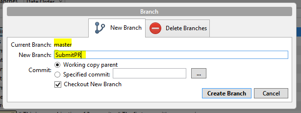

### Submitting a pull request

Pull requests let you tell others about changes you've pushed to a repository on GitHub. Once a pull request is created, interested parties can review the set of changes, discuss potential modifications, and even push follow-up commits if necessary. Anyone can submit a pull request and they're useful in the shared repository model where they're used to initiate code review and general discussion about a set of changes before being merged into a mainline branch.

#### Guidelines for Esri Staff
- Do not upload code provided by a user unless you have received explicit permission.
- If a user is looking for a specific sample that does not exist in our resource center and you are able to create it, then you can upload this sample. However, this sample should not include any names, comments, namespaces that are related with the user.

This guide outlines the step by step instructions for submitting a pull request using the SourceTree desktop client application (http://www.sourcetreeapp.com/)

* Before you start the process, make sure that you have set up remote tracking. This is what allows you to keep abreast of changes to the fork and origin repositories that Github is hosting and push your changes up. In order to do this, you can simply right-click on the remotes in SourceTree and select "New remote". One will point to your remote fork (for example: afili/developer-support) and one will point to the original repository (esri/developer-support) as shown in the picture below. Note: You can name them whatever you want, but it has become a convention to name the fork 'origin' and the original repository 'upstream', so its helpful to use those names if you plan on perusing StackOverflow for help.

* Fork the repository by navigating to the repository on the Github website and clicking the "Fork" button

* Clone a copy of the repository locally by clicking the "Clone in desktop" button

* Before you do any changes, make sure that local master is up to date with the commits upstream. In order to do so you have to fetch the branches from the upstream repository, check out your fork's local master branch and then merge the changes from upstream/master into your local master branch. [Syncing a fork](https://help.github.com/articles/syncing-a-fork/) describes this process in more detail.

* Create a new feature branch in SourceTree. When you create a new branch make sure that you select the master as the current branch

* Add a new code sample, and once you are satisfied with the addition, commit the change by clicking the "Commit" button in SourceTree. Before you commit the changes, you will have to provide a commit message that describes your changes.

* Push the change to your fork. Click the "Push" button and make sure to select the correct repository and branch to push. You will want to push the changes to your fork and not to the upstream directly. In order to do so you need to have two remotes set up.

* Use Github to create your Pull Request. Click the pull requests button on the repository [homepage](https://github.com/esri/developer-support/) and select "New pull request". The comparing changes page will open. You can click the button "compare across forks" and then select your fork and branch as shown in the picture below.

* Participate in the discussion with an open mind during code review, utilizing additional commits to make additional alterations
* (optional) Squash unique commits down into one when everyone is happy with the PR. This [link](http://gitready.com/advanced/2009/02/10/squashing-commits-with-rebase.html) will be helpful.
