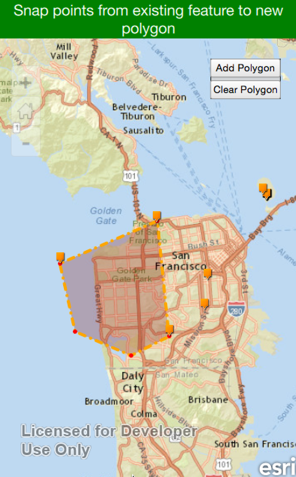

# Snapping points from existing feature as vertices for new draw polygon  
This application aims to show you how to snap points from existing map service when creating graphic polygon on basemap. By using this function is it easy for users who need to draw graphics that interact with existing features to perform measurement calculation or analysis.

The sample uses the ArcGIS Runtime Qt 10.2.6 an ArcGIS Online Feature service.



## Steps to Recap how to make it works
1)  Import ArcGIS Runtime QT in main.qml file.

```qml
import ArcGIS.Runtime 10.26
import ArcGIS.Runtime.Toolkit.Controls 1.0
```

2)  Add two properties as flags to control the addPoint function.

```qml
property bool firstPoint: true
property bool isDone: false
```

3)  Then add two buttons to control the graphic editing. One button is "Add Polygon" to enable edit, the other button is "Clear Polygon" to clear graphic on map and reset the firstPoint = ture and isDone = false.

```qml
    Button {
        text: "Add Polygon"
        ...
        onClicked: {
                     isDone = true;
                   }
           }
...
    Button {
        text: "Clear Polygon"
        ...
        onClicked: {
            if (userPolygon.pathCount > 0)
                   userPolygon.removePath(0);
                   isDone = false;
                   firstPoint = true;
                   featureLayer.clearSelection();
                   graphicsLayer.removeAllGraphics();
               }
           }
```

4)  Use the method *FeatureLayer::findFeatures* to determin whether the mouse click is selected any point features from loaded map service.

```qml
 var featureIds = featureLayer.findFeatures(mousex, mousey, 5, 1);
```

5) We then need to implement the logic about addPoint function, there are two different scenarios:
  1. Use the mouse click point location as geometry for polygon's point - **MapPoint (x,y)**
  2. Use the existing point feature geometry for polygon's point - **Existing Point feature (x,y)**

```qml
    if (featureIds.length == 0) {

        //Check if any point features that fall within the mouse click range,
        //if no points fall the tolerance range just add mouse point
        userPolygon.lineTo(mapPoint.x, mapPoint.y);
        console.log("Mouse click location: " + mapPoint.x, mapPoint.y)
        graphicClone.geometry = userPolygon;
        graphicsLayer.updateGraphic(polyGraphicId,graphicClone);
        newPoint.geometry = mapPoint;
        graphicsLayer.addGraphic(newPoint);

        } else {
        //mouse click location close enough to the point feature,
        //then snap the features's point as the next vertix of graphic polygon
        var selectedFeatureId = featureIds[0];
        var selectedFeature = featureServiceTable.feature(selectedFeatureId);
        var selectedPoint =selectedFeature.geometry

        userPolygon.lineTo(selectedPoint.x, selectedPoint.y);
        console.log("Point feature location: " + selectedPoint.x, selectedPoint.y)
        graphicClone.geometry = userPolygon;
        graphicsLayer.updateGraphic(polyGraphicId,graphicClone);

        newPoint.geometry = selectedPoint;
        graphicsLayer.addGraphic(newPoint);
        featureIds = null;
            }
```


## Resources

* [FeatureLayer.findFeatures Method Reference](https://developers.arcgis.com/qt/qml/api-reference/class_feature_layer.html#a683e2811207acc4db70cee43d5f62bbe)

* [Distance From Sample Reference](https://github.com/ldanzinger/RuntimeQtSamples/tree/master/distance_from)

* [Edit features guide](https://developers.arcgis.com/qt/qml/guide/edit-features.htm)


### Author
* Yue Wu (Nathan)
