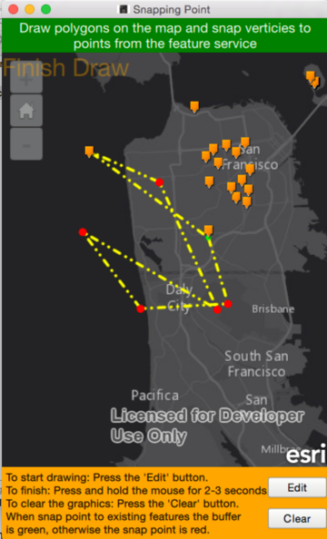

# Snap polygon verticies to existing point features
This app demonstrates how to draw polygons on a map with verticies that can snap to points from a feature service. This logic can be expanded upon to create tools that interact with existing features to perform tasks such as measurement calculations or analysis.

The sample uses the ArcGIS AppStudio AppFramework, based on the ArcGIS Runtime Qt 10.2.6.



## Steps to Recap how to make it works
1)  Import ArcGIS AppStudio AppFramework in the MyApp.qml.

```qml
import QtQuick 2.3
import QtQuick.Dialogs 1.2
import QtQuick.Controls 1.2
import QtQuick.Controls.Styles 1.2
import ArcGIS.AppFramework 1.0
import ArcGIS.AppFramework.Controls 1.0
import ArcGIS.AppFramework.Runtime 1.0
import ArcGIS.AppFramework.Runtime.Controls 1.0
```

2)  Add two properties as flags to control the addPoint function.

```qml
property bool firstPoint: true
property bool isDone: false
```

3)  Add two buttons to control graphic editing: "Edit" to enable editing, and "Clear" to clear all graphics on the map.  This also resets firstPoint = true and isDone = false.

```qml
    Button {
        text: "Clear"
        ...
        onClicked: {
                     isDone = true;
                   }
           }
...
    Button {
        text: "Clear"
        ...
        onClicked: {
            if (userPolygon.pathCount > 0)
                   userPolygon.removePath(0);
                   isDone = false;
                   firstPoint = true;
                   featureLayer.clearSelection();
                   graphicsLayer.removeAllGraphics();
               }
           }
```

4)  Use the method *FeatureLayer::findFeatures* to determine whether the mouse click has selected any point features from the loaded map service.

```qml
 var featureIds = featureLayer.findFeatures(mousex, mousey, 5, 1);
```

5) Implement the logic for the addPoint function.  There are two different scenarios:
  1. If the click is not within the tolerance of a point feature, use the mouse click point geometry for the polygon's point - **MapPoint (x,y)**
  2. If it is within the tolerance of a point feature, the existing point feature's geometry for polygon's point - **Existing Point feature (x,y)**

```qml
    if (featureIds.length == 0) {

        //Check if any point features fall within the mouse click range,
        //if no points fall within tolerance range just add mouse point
        userPolygon.lineTo(mapPoint.x, mapPoint.y);
        console.log("Mouse click location: " + mapPoint.x, mapPoint.y)
        graphicClone.geometry = userPolygon;
        graphicsLayer.updateGraphic(polyGraphicId,graphicClone);
        newPoint.geometry = mapPoint;
        graphicsLayer.addGraphic(newPoint);

        } else {
        //mouse click location close enough to the point feature,
        //snap the next vertex of graphic polygon to features's point
        var selectedFeatureId = featureIds[0];
        var selectedFeature = featureServiceTable.feature(selectedFeatureId);
        var selectedPoint =selectedFeature.geometry

        userPolygon.lineTo(selectedPoint.x, selectedPoint.y);
        console.log("Point feature location: " + selectedPoint.x, selectedPoint.y)
        graphicClone.geometry = userPolygon;
        graphicsLayer.updateGraphic(polyGraphicId,graphicClone);

        newPoint.geometry = selectedPoint;
        graphicsLayer.addGraphic(newPoint);
        featureIds = null;
            }
```


## Resources

* [FeatureLayer.findFeatures Method Reference](https://developers.arcgis.com/qt/qml/api-reference/class_feature_layer.html#a683e2811207acc4db70cee43d5f62bbe)

* [Distance From Sample Reference](https://github.com/ldanzinger/RuntimeQtSamples/tree/master/distance_from)

* [Edit features guide](https://developers.arcgis.com/qt/qml/guide/edit-features.htm)


### Author
* Yue Wu (Nathan)
