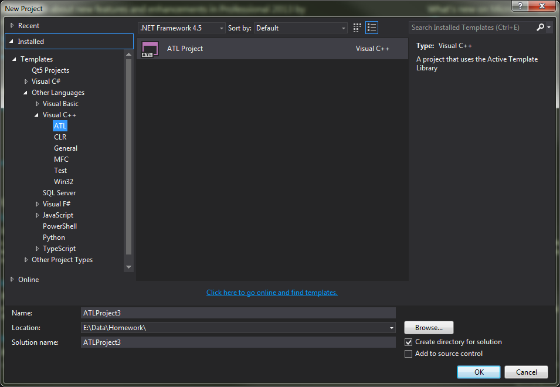
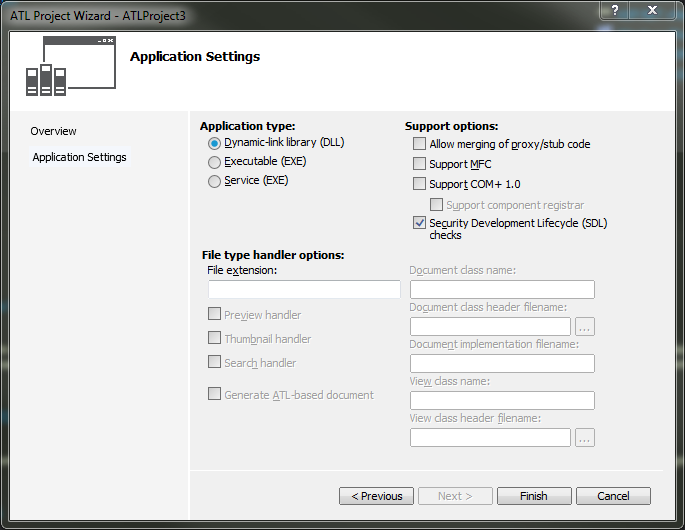
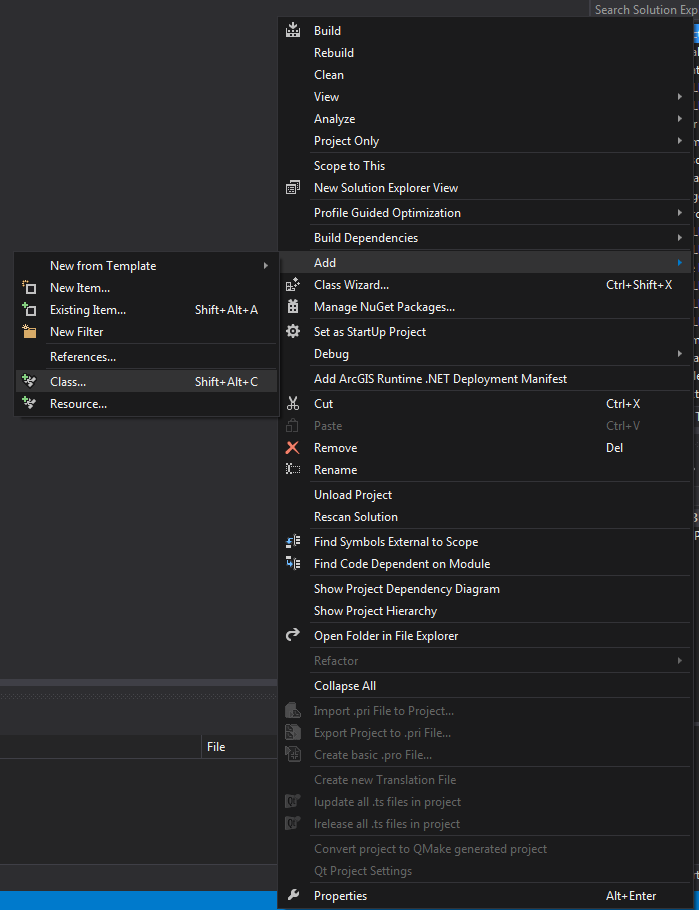
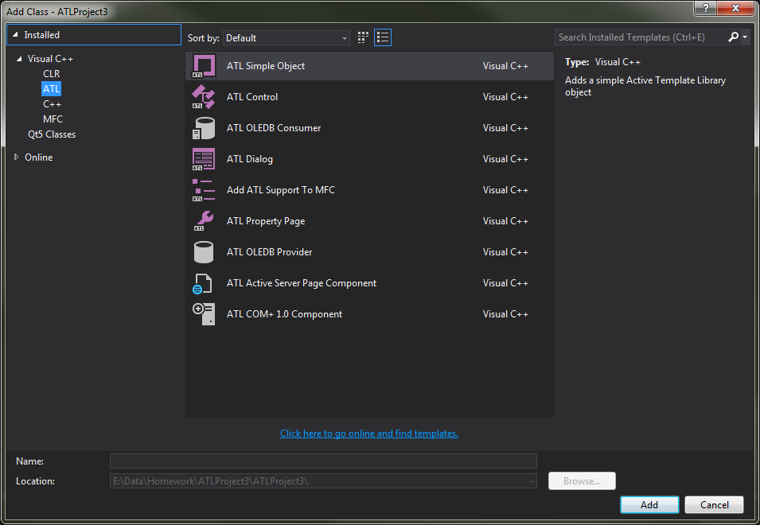
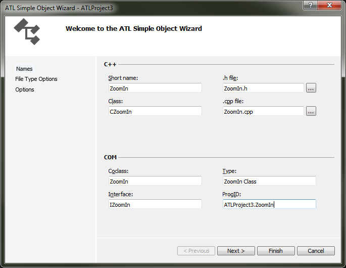
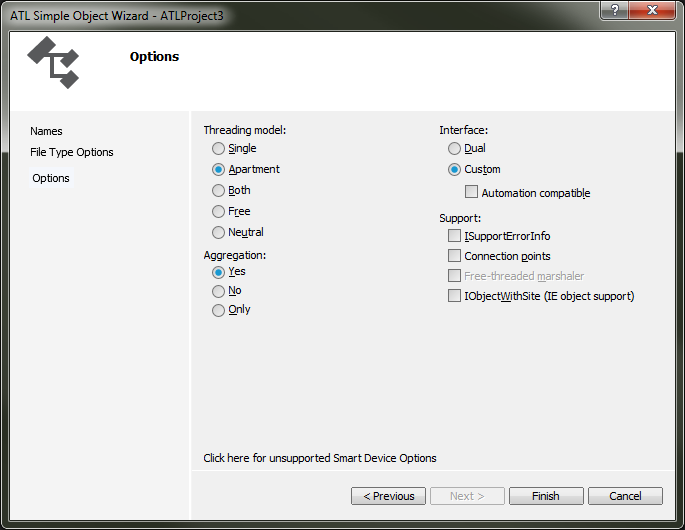
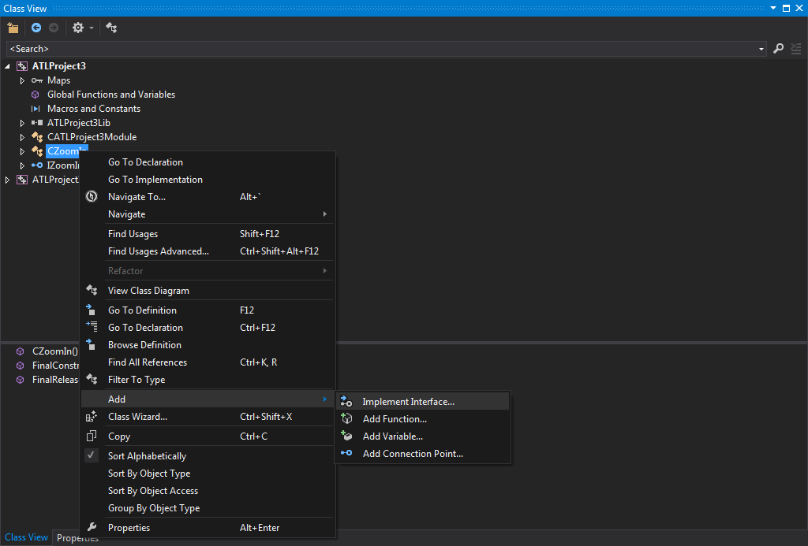
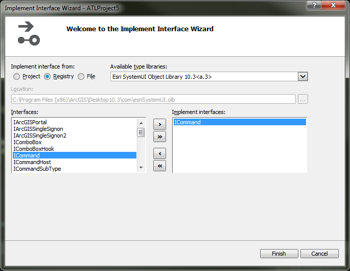
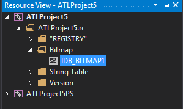
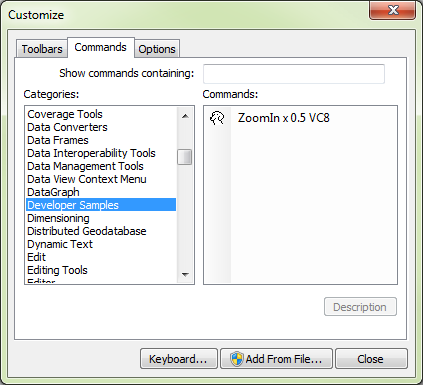

# Creating a Simple Command using ATL Using Visual Studio 2013
## Use Case
This is for anyone planning to create a command or COM component using the C++ libraries.  This command will be a tutorial for creating a command and will present users with a good foundation to grow their skills.
## Resources
[Creating a simple command](http://resources.arcgis.com/en/help/arcobjects-net/conceptualhelp/#/Walkthrough_Creating_a_simple_command/000100000n9z000000/)
## Instructions
1)  Start a new project in Visual Studio and select under the Visual C++ Option ATL and then select ATL Project and press ok.



2)  When the dialog comes up it will prompt you to select your Application settings.  Make sure that Dynamic-Link library (DLL) radio button is selected and then press finish.



3)  When the project is loaded, right click on the project name (In my case it is ATLProject3) and go to Add > Class...



4)  Under Visual C++ Choose ATL and select ATL Simple Object.  Then press Add.



5)  In the Short Name text box, type in **ZoomIn** and the rest of the boxes should populate except for ProgID.  In ProgID, type in **YOURPROJECT.SHORTNAME**.  In my case, it would look like this:



6)  Next go to the options menu and make sure that the Threading Model is set to Apartment, Aggregation is Yes, and finally interface is set to custom.  Then click finish.



7)  The next step would be to modify the IDL file.  For myself, that would be found in the **Source Files** folder as **ATLProject3.idl**.  Here, we find the library (**ATLProject3Lib**) and add **importlib("stdole32.tlb");** before **importlib("stdole2.tlb");**.

Then, we modify **coclass ZoomIn** by changing:

```c++
[default] interface IZoomIn;
```
to
```c++
[default] interface IUnknown;
interface IZoomIn;
  ```

This would make the resulting **ATLProjectLib** look something closer to this:
```c++
library ATLProject3Lib
{
  importlib("stdole32.tlb");
	importlib("stdole2.tlb");
	[
		uuid(1B6F2116-3479-4835-B080-16CEB4076D6C)
	]
	coclass ZoomIn
	{
    //[default] interface IUnknown;
		[default] interface IUnknown;
		interface IZoomIn;
	};
};
```

**THE NEXT TWO STEPS NEED TO BE DONE IN ORDER**

8)  The next step would be to open the **stdafx.h** file found in the **Header Files** folder and reference the ESRI object libraries you would like to use.  This is the list I used in making this sample:

```c++
#pragma warning(push)
#pragma warning(disable : 4192)
  //disables warning: automatically excluding 'name' while importing type library 'library'

//import esriSystem.olb
#import "libid:5E1F7BC3-67C5-4AEE-8EC6-C4B73AAC42ED" raw_interfaces_only raw_native_types no_namespace named_guids exclude("OLE_COLOR", "OLE_HANDLE", "VARTYPE", "XMLSerializer")

//import esriSystemUI.olb
#import "libid:4ECCA6E2-B16B-4ACA-BD17-E74CAE4C150A" raw_interfaces_only raw_native_types no_namespace named_guids exclude("OLE_HANDLE", "OLE_COLOR")

//import esriGeometry.olb
#import "libid:C4B094C2-FF32-4FA1-ABCB-7820F8D6FB68" raw_interfaces_only raw_native_types no_namespace named_guids exclude("OLE_HANDLE", "OLE_COLOR", "ISegment")

//import esriDisplay.olb
#import "libid:59FCCD31-434C-4017-BDEF-DB4B7EDC9CE0" raw_interfaces_only raw_native_types no_namespace named_guids exclude("OLE_HANDLE", "OLE_COLOR")

//import esriGeoDatabase.olb
#import "libid:0475BDB1-E5B2-4CA2-9127-B4B1683E70C2" raw_interfaces_only raw_native_types no_namespace named_guids

//import esriCarto.olb
#import "libid:45AC68FF-DEFF-4884-B3A9-7D882EDCAEF1" raw_interfaces_only raw_native_types no_namespace named_guids exclude("UINT_PTR")

//import esriControls.olb
#import "libid:033364CA-47F9-4251-98A5-C88CD8D3C808" raw_interfaces_only raw_native_types no_namespace named_guids
#import "C:\Program Files (x86)\ArcGIS\Desktop10.3\com\esriSystemUI.olb" raw_interfaces_only, raw_native_types, no_namespace, named_guids, auto_search

#pragma warning(pop)
```

9)  Open up the class view in Visual Studio and right click on CZoomIn.  Go to Add and then Implement Interface to open the Implement Interface Wizard.



In here, you will choose the registry radio button and then find the  **Esri SystemUI Object Library 10.3** type library from the drop down.  You will then double click on ICommand becuase in this scenario, we are building a small command.  Make sure your window matches the one seen here and then press finish.




10)  Open your **ZoomIn.h** file and make the following modifications.

Remove the body of the following methods:
* CZoomIn()
* STDMETHOD(get_Enabled)(VARIANT_BOOL * Enabled);
* STDMETHOD(get_Name)(BSTR * Name);
* STDMETHOD(get_Caption)(BSTR * Caption);
* STDMETHOD(get_Bitmap)(OLE_HANDLE * Bitmap);
*	STDMETHOD(get_Category)(BSTR * categoryName);
*	STDMETHOD(OnCreate)(LPDISPATCH Hook);
*	STDMETHOD(OnClick)();

Then right after CZoomIn(), add the destructor  ~CZoomIn()

Finally, after all the public declarations, add a private declaration to:

**HBITMAP m_hBitmap;**

After all this is done, your class should look like this

```c++
class ATL_NO_VTABLE CZoomIn :
	public CComObjectRootEx<CComSingleThreadModel>,
	public CComCoClass<CZoomIn, &CLSID_ZoomIn>,
	public IZoomIn,
	public ICommand
{
public:
	CZoomIn();
	~CZoomIn();

	DECLARE_REGISTRY_RESOURCEID(IDR_ZOOMIN)


	BEGIN_COM_MAP(CZoomIn)
		COM_INTERFACE_ENTRY(IZoomIn)
		COM_INTERFACE_ENTRY(ICommand)
	END_COM_MAP()

	struct __declspec(uuid("B56A7C42-83D4-11d2-A2E9-080009B6F22B")) CATID_MxCommands;

	BEGIN_CATEGORY_MAP(__uuidof(CATID_ControlsCommands))
		IMPLEMENTED_CATEGORY(__uuidof(CATID_MxCommands))
	END_CATEGORY_MAP()


	DECLARE_PROTECT_FINAL_CONSTRUCT()

	HRESULT FinalConstruct()
	{
		return S_OK;
	}

	void FinalRelease()
	{
	}

public:


	// ICommand Methods
public:
	STDMETHOD(get_Enabled)(VARIANT_BOOL * Enabled);
	STDMETHOD(get_Checked)(VARIANT_BOOL * Checked)
	{
		return E_NOTIMPL;
	}
	STDMETHOD(get_Name)(BSTR * Name);
	STDMETHOD(get_Caption)(BSTR * Caption);
	STDMETHOD(get_Tooltip)(BSTR * Tooltip)
	{
		return E_NOTIMPL;
	}
	STDMETHOD(get_Message)(BSTR * Message)
	{
		return E_NOTIMPL;
	}
	STDMETHOD(get_HelpFile)(BSTR * HelpFile)
	{
		return E_NOTIMPL;
	}
	STDMETHOD(get_HelpContextID)(long * helpID)
	{
		return E_NOTIMPL;
	}
	STDMETHOD(get_Bitmap)(OLE_HANDLE * Bitmap);
	STDMETHOD(get_Category)(BSTR * categoryName);
	STDMETHOD(OnCreate)(LPDISPATCH Hook);
	STDMETHOD(OnClick)();

private:
	HBITMAP m_hBitmap;

};
```

11)  Then we would go to our implementation file **ZoomIn.cpp**

We start by adding a property here to allow the our COM component to Hook into the application.  Then we would implement our methods.  In its simplest form, it would look something like this. (*This code has not been comprehensively evalueated for errors.*)

```c++
IHookHelperPtr m_ipHookHelper;
STDMETHODIMP CZoomIn::get_Enabled(VARIANT_BOOL *Enabled)
{
  if (Enabled == NULL)
    return E_POINTER;

  *Enabled = VARIANT_TRUE; // Enable the tool always

  return S_OK;
}

CZoomIn::CZoomIn()
{
  m_hBitmap = ::LoadBitmap(_AtlBaseModule.GetResourceInstance(), MAKEINTRESOURCE(IDB_BITMAP1));
}

CZoomIn::~CZoomIn()
{
  DeleteObject(m_hBitmap);
}

STDMETHODIMP CZoomIn::get_Name(BSTR *Name)
{
  if (Name == NULL)
    return E_POINTER;

  *Name = ::SysAllocString(L"ZoomIn x 0.5 VC8");
  return S_OK;
}

STDMETHODIMP CZoomIn::get_Caption(BSTR *Caption)
{
  if (Caption == NULL)
    return E_POINTER;

  *Caption = ::SysAllocString(L"ZoomIn x 0.5 VC8");
  return S_OK;
}

STDMETHODIMP CZoomIn::get_Category(BSTR *Category)
{
  if (Category == NULL)
    return E_POINTER;

  *Category = ::SysAllocString(L"Developer Samples");
  return S_OK;
}

STDMETHODIMP CZoomIn::get_Bitmap(OLE_HANDLE *Bitmap)
{
  if (Bitmap == NULL)
    return E_POINTER;

  *Bitmap = (OLE_HANDLE)m_hBitmap;

  return S_OK;
}

STDMETHODIMP CZoomIn::OnCreate(IDispatch *hook)
{
  m_ipHookHelper.CreateInstance(CLSID_HookHelper);
  HRESULT hr = m_ipHookHelper->putref_Hook(hook);

  return hr;
}

STDMETHODIMP CZoomIn::OnClick()
{
  // HRESULT checking omitted for clarity
  IActiveViewPtr ipActiveView;
  m_ipHookHelper->get_ActiveView(&ipActiveView);

  IEnvelopePtr ipEnv;
  ipActiveView->get_Extent(&ipEnv);
  ipEnv->Expand(0.5, 0.5, VARIANT_TRUE);
  ipActiveView->put_Extent(ipEnv);
  ipActiveView->Refresh();

  return S_OK;
}
```

In the zoom in constructor, we are missing our Bitmap image:
```c++
CZoomIn::CZoomIn()
{
  m_hBitmap = ::LoadBitmap(_AtlBaseModule.GetResourceInstance(), MAKEINTRESOURCE(IDB_BITMAP1));
}
```
**NOTE: PNG IMAGES DO NOT WORK HERE**

To get a bitmap into your project, right click on your project name then go to Add > Resource.  Select BitMap and then press import.  A BMP file has been included in this repo to help you if you do not have one at hand.  Once the BMP has been added, double click on your **projectName.rc** file in the solution explorer.  This should open the resource view for your project.  Under BitMap, you should find something similar to IDB_BITMAP1 which is the bitmap you added.  If you have something different, that is okay.  Replace the IDB_BITMAP1 in the CZoomIn constructor with the name that appears for your resource.



12)  Finally, in order for ArcMap to be able to find your COM component, we need to add category mapping.  Add the following lines under the END_COM_MAP() in your **ZoomIn.h** file.  The first line defines the CATID_MxCommands as its type based of the GUID.  The rest helps users find it in their customize dialog.

```c++
struct __declspec(uuid("B56A7C42-83D4-11d2-A2E9-080009B6F22B")) CATID_MxCommands;

BEGIN_CATEGORY_MAP(__uuidof(CATID_ControlsCommands))
  IMPLEMENTED_CATEGORY(__uuidof(CATID_MxCommands))
END_CATEGORY_MAP()
```

This will allow your users to find the component under the commands tab in the customize mode.



Build your solution and register your DLL, you are done!

**Time to Celebrate**


