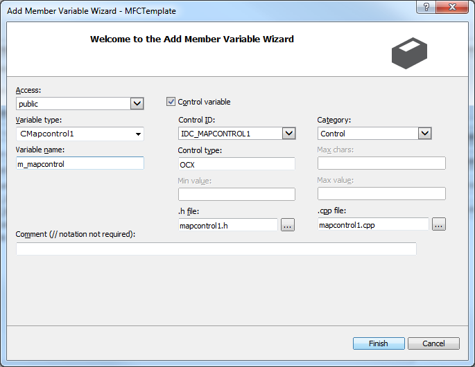

# Accessing ArcObjects Active X Controls in MFC
## Use Case
The [previous git sample](../mfc-template) went and showed users how to get started with using MFC to program their ArcObjects projects.  This got a lot of users started, however, a lot of users felt lost when it came to using the map control added to the project.  This sample aims to show users how to get a hook to the map control in order to use it within their application.

## Steps
**This sample assumes that you have completed the [previous git sample](../mfc-template) and would like to continue with accessing the map control added to that project.  A completed version of this sample is attached.**

1)  Open your *stdafx.h* file.  In this file, we need to add some references to our project that will be used by most for their map control application.  At the end of the *stdafx.h* file add the following lines:

```cpp
#pragma warning(push)
#pragma warning(disable : 4192) /* Ignore warnings for types that are duplicated in win32 header files */
#pragma warning(disable : 4146) /* Ignore warnings for use of minus on unsigned types */
#pragma warning(disable: 4278)

#import "c:\Program Files (x86)\ArcGIS\Engine10.3\com\esriSystem.olb" raw_interfaces_only, raw_native_types, no_namespace, named_guids, exclude("OLE_COLOR", "OLE_HANDLE", "VARTYPE")
#import "c:\Program Files (x86)\ArcGIS\Engine10.3\com\esriSystemUI.olb" raw_interfaces_only, raw_native_types, no_namespace, named_guids, exclude ("ICommand") exclude ("IProgressDialog")
#import "c:\Program Files (x86)\ArcGIS\Engine10.3\com\esriGeometry.olb" raw_interfaces_only, raw_native_types, no_namespace, named_guids
#import "c:\Program Files (x86)\ArcGIS\Engine10.3\com\esriDisplay.olb" raw_interfaces_only, raw_native_types, no_namespace, named_guids
#import "c:\Program Files (x86)\ArcGIS\Engine10.3\com\esriOutput.olb" raw_interfaces_only, raw_native_types, no_namespace, named_guids
#import "c:\Program Files (x86)\ArcGIS\Engine10.3\com\esriGeoDatabase.olb" raw_interfaces_only, raw_native_types, no_namespace, named_guids, rename("IRow", "IRow2"), exclude ("ICursor")
#import "c:\Program Files (x86)\ArcGIS\Engine10.3\com\esriGISClient.olb" raw_interfaces_only, raw_native_types, no_namespace, named_guids exclude ("UINT_PTR")
#import "c:\Program Files (x86)\ArcGIS\Engine10.3\com\esriDataSourcesRaster.olb" raw_interfaces_only, raw_native_types, no_namespace, named_guids
#import "c:\Program Files (x86)\ArcGIS\Engine10.3\com\esriCarto.olb" raw_interfaces_only, raw_native_types, no_namespace, named_guids exclude ("ITableDefinition") exclude ("UINT_PTR")
#import "c:\Program Files (x86)\ArcGIS\Engine10.3\com\esriControls.olb" raw_interfaces_only, raw_native_types, no_namespace, named_guids exclude ("ITableDefinition") exclude ("UINT_PTR")
#pragma warning(pop)
```
2)  Then, open your *IDD_MFCTEMPLATE_DIALOG*.  This can be found in your *MFCTemplate.rc* file.

3)  Inside the dialog, right click on the MapControl and click on the Class Wizard in the context menu.

4)  From there, click on the member variables tab.

5)  In the member variables tab, we will find the IDC_MAPCONTROL1 item (or whatever ID you assigned your map control) and click it once so it is highlighted.  After we highlight it, we click on *Add Variable...*

6)  What this does, is it adds the map control as a member variable of the dialog box so we may access it through code.  In the variable name box, add m_mapcontrol then click finish.  This will automagically generate the header and implementation file that allows us to gain access to the methods and properties within the map control object.



7)  You will be returned to the member variables box after pressing finish.  Go ahead and press ok to close the class wizard dialog window and commit changes.

8)  After this is completed, the *MFCTemplateDlg.h* file adds the
```cpp
CMapControl1 m_mapcontrol;
```
line linking your member variable to the newly added class file mapcontrol1.h.  Then in your implementation file, it will add the
```cpp
DDX_Control(pDX, IDC_MAPCONTROL1, m_mapcontrol);
```
line implementing the control linking to the variable itself.

You should now be able to access the mapcontrol in code through the member variable.

## Additional Resources:

* [MFC and the ActiveX Controls](http://resources.arcgis.com/en/help/arcobjects-net/conceptualhelp/index.html#/MFC_and_the_ActiveX_Controls/000100000nn9000000/)
* [Document for C++ Developers forum post](http://forums.esri.com/thread.asp?c=93&f=1154&t=68541#233366)

###### Authors:
* Alexander Nohe
