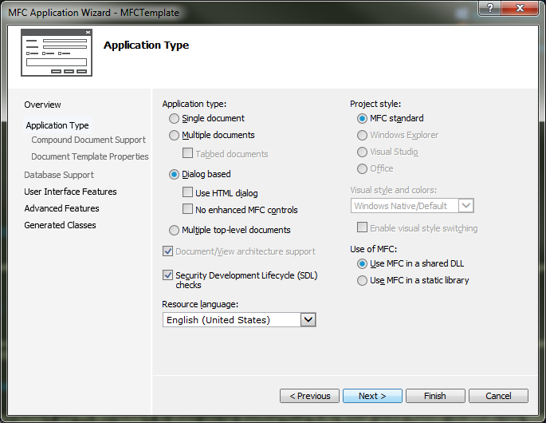
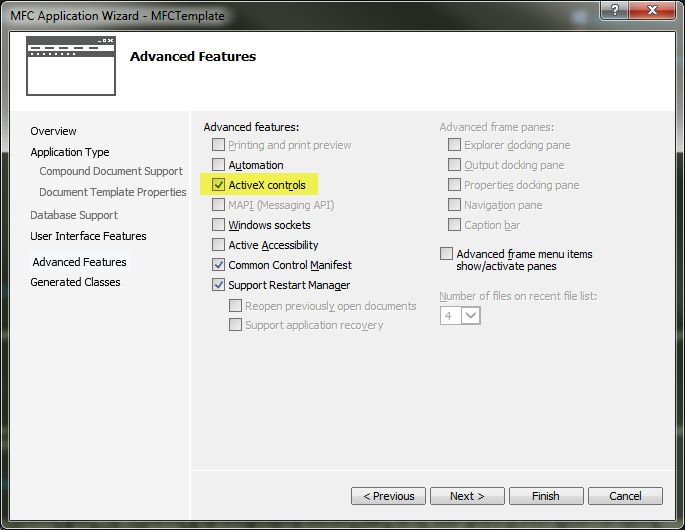
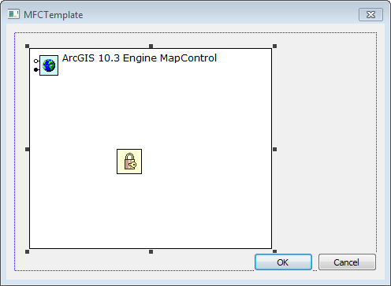

#MFC Template
##Use Case
Trying to figure out how to get started with an MFC Dialog using C++ can be tough and leaves many users wondering how to get started.


This is supposed to be a sample showing you what needs to be added to the blank MFC template to get started quickly and easily.  In addition, the solution file is attached so users can download and get started right away.

##Steps
1) The first step is to open Visual Studio and then select MFC Application.

2) Upon selecting MFC Application you are presented with a wizard.  The relevant pages in the wizard are where you select your application type.  The user should select Dialog Based and make sure that Use MFC in a shared DLL is selected.



3) In this step, make sure that ActiveX controls are activated.  Then press Finish.




4)  Right click on the MFC canvas and add a license control and a map control to your MFC application.



5)  Open the stdafx.h file and in the bottom of the file, add a reference to the ArcGISVersion.dll
```cpp
#import "C:\Program Files (x86)\Common Files\ArcGIS\bin\ArcGISVersion.dll" raw_interfaces_only, raw_native_types, no_namespace, named_guids, rename("esriProductCode", "esriVersionProductCode")
```

6)(Optional) In lieu of adding the license control in step #4, open the program file that you created (in the sample, it would be the MFCTemplate.cpp file, not the MFCTemplateDlg.cpp file) and find the BOOL CMFCTemplateApp::InitInstance() method.  Add the following to it which will initialize the application and check out a license.
```cpp
::CoInitialize(NULL);
{
  CComPtr<IArcGISVersion> pArcGISVersion;
  if (SUCCEEDED(pArcGISVersion.CoCreateInstance(CLSID_VersionManager)))
  {
    VARIANT_BOOL vbSucceeded = VARIANT_FALSE;
    if (SUCCEEDED(pArcGISVersion->LoadVersion(esriArcGISDesktop, CComBSTR("10.3"), &vbSucceeded)) && (vbSucceeded == VARIANT_TRUE))
    {
      // ::MessageBox(0, "ArcGIS Desktop 10.2", "Debug", MB_OK);  
    }
  }
}
```

From here, you should be able to proceed with creating your application.

##Additional Resources
* [MFC and the ActiveX Controls](http://resources.arcgis.com/en/help/arcobjects-net/conceptualhelp/index.html#/MFC_and_the_ActiveX_Controls/000100000nn9000000/)
* [Video Documenting the process](http://screencast.com/t/eeD5HwvjsVu)

######Authors
* Alexander N.
* Andrew W.
