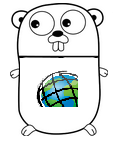

# Go-lang ArcGIS Online Package
## Use case
This is to provide the groundwork for people interested in pursuing the go language for interacting with ArcGIS Online.  At the time of writing this, it quickly generates a token for users that plug in their username.

In addition, go-lang is an exciting language that is being backed by Google.  This link will provide users [with use cases to start using the go-lang](https://gist.github.com/ungerik/3731476).

## Code snippet for generating a token using the package
```go
package main

import (
	"fmt"
	
	//This will change based upon your installation path and where you downloaded it from.
	"github.com/nohe427/agol"
)

func main() {
	tokenresponse := agol.GetToken("sample_user", "sample_password")
	fmt.Println(tokenresponse.Token)
}
```

## How to get started with go-lang
* [The Go Programming Language](https://golang.org)
* [Getting started with Go](https://golang.org/doc/install)
* [Your first library](https://golang.org/doc/code.html#Library) (Good for installing the ArcGIS Online package)

##### Authors:
* Alexander Nohe


```
The Go gopher was designed by Renee French. (http://reneefrench.blogspot.com/)
The design is licensed under the Creative Commons 3.0 Attributions license.
Read this article for more details: https://blog.golang.org/gopher
```
