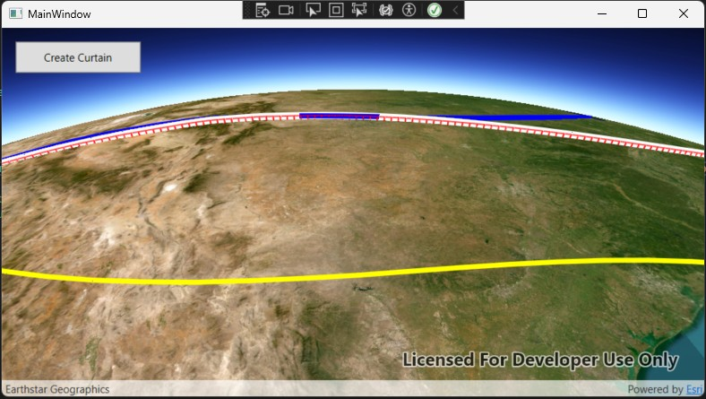

# Flight Path Curtains

A WPF desktop application built with the **ArcGIS Runtime SDK for .NET** that renders synthetic 3D airline flight paths over a global scene and lets you drape a semi-transparent "curtain" from any selected route down to the terrain surface.

## Overview

The app displays three color-coded flight routes originating from Los Angeles:

| Route         | Color     | Destination  |
| ------------- | --------- | ------------ |
| LA → New York | 🔴 Red    | New York, NY |
| LA → Chicago  | 🔵 Blue   | Chicago, IL  |
| LA → Miami    | 🟡 Yellow | Miami, FL    |

Each route is generated as a 3D polyline with realistic climb, cruise, and descent phases, plus a gentle sinusoidal curve so the paths don't appear as perfectly straight lines. You can click any route to select it, then generate a vertical curtain that visually connects the flight path to the ground below.

## Features

- **3D flight path rendering** — Routes are drawn as relative-elevation polylines with a simulated flight profile (climb → cruise → descent).
- **Interactive selection** — Click any flight path in the scene to select it; the selected route is highlighted with a thicker white line.
- **Terrain curtains** — Select a route and click **Create Curtain** to drape a semi-transparent, color-matched curtain from the flight path down beneath the terrain.
- **Distance-based densification** — Curtain panels are generated at a fixed spacing (~25 km) along the route using the haversine formula, avoiding over-densification on sharp turns.
- **Vertical rib lines** — Each curtain vertex gets a vertical rib for a lattice-like, easy-to-read appearance.
- **Persistent curtains** — Curtains remain in the scene when you select and build curtains for other routes; duplicate curtains for the same route are prevented.

## How It Works

### Flight path generation

`GenerateFlightPath` interpolates vertices between a start and end coordinate. Altitude follows a three-phase profile:

- **0–20%** — climb to cruise altitude
- **20–80%** — cruise with a small sinusoidal altitude variation
- **80–100%** — descent to the destination

A sinusoidal offset is added to the latitude to simulate route deviations caused by air traffic or weather.

### Route selection

`MainSceneView_GeoViewTapped` performs a hit-test against the flight overlay. If a route is hit, `SelectFlightPath` highlights it in white; clicking empty space clears the current selection via `ClearSelectedFlightPath`, which restores the route's original color.

### Curtain construction

When you click **Create Curtain**:

1. `CreateCurtainPointsEveryKilometers` builds an evenly spaced set of curtain vertices (~25 km apart) using `CalculateDistanceKilometers` (haversine) and `InterpolateMapPoint`.
2. For each pair of adjacent curtain points, a rectangular polygon is built from the two top vertices down to a fixed bottom elevation (`-12000 m`), forming one curtain panel.
3. Vertical rib polylines are added at every curtain vertex.
4. The panels and ribs are color-matched to the selected route (semi-transparent fill, more opaque outline and ribs) and added to the curtain overlay.

## Requirements

- Windows with .NET (WPF)
- [ArcGIS Runtime SDK for .NET](https://developers.arcgis.com/net/)
- Visual Studio 2019 or later (recommended)

## Getting Started

1. Clone the repository.
2. Open the solution in Visual Studio.
3. Restore NuGet packages (ArcGIS Runtime SDK for .NET).
4. Build and run the project.
5. Click a flight path to select it, then click **Create Curtain** to drape a curtain to the terrain.

## Project Structure

- **MainWindow.xaml** — Defines the `SceneView` (`MainSceneView`) and the **Create Curtain** button UI.
- **MainWindow.xaml.cs** — Contains all application logic:
  - `AddFlightPaths` / `AddFlightPath` — build and register the three routes
  - `GenerateFlightPath` — synthesize 3D route vertices
  - `MainSceneView_GeoViewTapped` / `SelectFlightPath` / `ClearSelectedFlightPath` — selection handling
  - `CreateCurtainButton_Click` / `CreateCurtainForSelectedFlightPath` — curtain generation
  - `CreateCurtainPointsEveryKilometers` / `CalculateDistanceKilometers` / `InterpolateMapPoint` / `DegreesToRadians` — curtain densification helpers

## Key Concepts

- **GraphicsOverlay** — Two overlays are used: one for flight paths and one for curtains, both set to `SurfacePlacement.Relative`.
- **SurfacePlacement.Relative** — Positions graphics relative to the elevation surface, allowing altitudes and below-ground curtain bottoms to render correctly.
- **Haversine distance** — Ensures curtain panels are spaced by true surface distance rather than by raw vertex count.

## License

Add your license information here.
