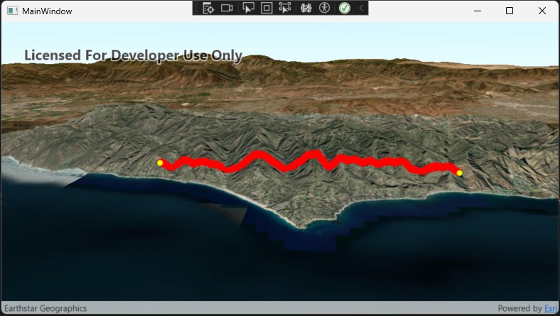

# Interactive Terrain-Following Polyline Sample for ArcGIS Maps SDK for .NET



This sample extends the ArcGIS Maps SDK for .NET **Display a Scene** sample by allowing users to interactively create a terrain-following polyline in a 3D SceneView.

Users can click anywhere on the terrain to add route vertices. The application automatically:

- Captures mouse clicks in the SceneView.
- Builds a polyline from the selected locations.
- Densifies the polyline to improve terrain sampling.
- Queries the WorldElevation3D surface using `ApplyElevationAsync()`.
- Creates a 3D route that follows the terrain.
- Displays route vertices and the resulting terrain-following line.

---

## Features

- 3D ArcGIS SceneView
- WorldElevation3D terrain
- Interactive mouse click drawing
- Terrain-following polyline generation
- Automatic elevation sampling
- Polyline densification for improved terrain accuracy
- Visual route vertex markers
- GraphicsOverlay-based rendering

---

## How It Works

The workflow is:

```text
Mouse Click
    ↓
MapPoint (XY)
    ↓
Polyline Builder
    ↓
Densify Polyline
    ↓
ApplyElevationAsync()
    ↓
Terrain-Following Polyline
    ↓
Display in GraphicsOverlay
```

### 1. User Clicks the Terrain

The SceneView captures user clicks using:

```csharp
GeoViewTapped
```

Each click produces a `MapPoint`.

---

### 2. Build a Polyline

Every selected location is added to an internal list:

```csharp
private readonly List<MapPoint> _clickedPoints;
```

The vertices are used to construct a polyline:

```csharp
PolylineBuilder builder =
    new PolylineBuilder(point2D.SpatialReference);
```

---

### 3. Densify the Geometry

The polyline is densified before elevation sampling.

```csharp
Polyline densePolyline =
    (Polyline)GeometryEngine.DensifyGeodetic(
        polylineWithoutZ,
        25,
        LinearUnits.Meters,
        GeodeticCurveType.Geodesic);
```

Adding intermediate vertices produces a route that follows hills and valleys more accurately.

---

### 4. Apply Terrain Elevation

The ArcGIS Runtime 300.x `ApplyElevationAsync()` method is used to assign elevation values to all vertices in the route.

```csharp
Geometry elevatedGeometry =
    await Scene.BaseSurface.ApplyElevationAsync(
        densePolyline);
```

This converts an XY polyline into a 3D terrain-following polyline.

---

### 5. Display the Route

The route is rendered as a graphic:

```csharp
_lineGraphic.Geometry = elevatedGeometry;
```

using:

```csharp
SimpleLineSymbol
```

inside a:

```csharp
GraphicsOverlay
```

---

## Technologies

- ArcGIS Maps SDK for .NET 300.x
- WPF (.NET 8)
- SceneView
- GraphicsOverlay
- WorldElevation3D Service
- GeometryEngine
- ApplyElevationAsync()

---

## Project Structure

```text
DisplayAScene
│
├── MainWindow.xaml
├── MainWindow.xaml.cs
├── SceneViewModel.cs
│
└── README.md
```

### MainWindow.xaml

Contains the SceneView control and data bindings.

### MainWindow.xaml.cs

Handles user interaction events such as:

```csharp
GeoViewTapped
```

### SceneViewModel.cs

Responsible for:

- Scene creation
- Terrain setup
- Graphics overlay creation
- Clicked point storage
- Polyline construction
- Terrain elevation sampling
- Route visualization

---

## Key ArcGIS API Calls

### Create a Scene

```csharp
Scene scene =
    new Scene(BasemapStyle.ArcGISImageryStandard);
```

### Add Terrain

```csharp
ArcGISTiledElevationSource elevationSource =
    new ArcGISTiledElevationSource(
        new Uri(elevationServiceUrl));
```

### Densify Geometry

```csharp
GeometryEngine.DensifyGeodetic(...)
```

### Apply Terrain Elevation

```csharp
await Scene.BaseSurface.ApplyElevationAsync(...)
```

### Display Graphics

```csharp
GraphicsOverlay
Graphic
SimpleLineSymbol
SimpleMarkerSymbol
```

---

## Requirements

### Software

- Visual Studio 2022
- .NET 8
- ArcGIS Maps SDK for .NET 300.x

### NuGet Packages

Install:

```text
Esri.ArcGISRuntime.WPF
```

---

## Future Enhancements

Potential improvements include:

- Rubber-band sketching while moving the mouse
- Double-click to finish sketch
- Right-click to clear the route
- Save route to a feature class
- Geodesic length calculation
- Route editing
- Undo/Redo support
- Export to Shapefile or GeoJSON

---

## Credits

This project is based on Esri's **Display a Scene** sample and extends it with interactive terrain-following route creation.

ArcGIS Maps SDK for .NET:

https://developers.arcgis.com/net/

---

## Author

Lawrence Orijuela

Support Analyst II | GIS Developer Enthusiast

Built with ArcGIS Maps SDK for .NET 300.x and WPF.
