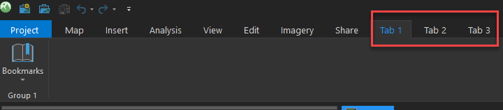

## Referencing Add-In projects in a Managed Configuration Project via DAML

This sample demonstrates how to reference Add-In projects in a Managed Configuration project DAML file.


<!-- TODO: Fill this section below with metadata about this sample-->
```
Language:              C#
Subject:               Framework
Organization:          Esri, http://www.esri.com
Date:                  03/6/2020
ArcGIS Pro SDK:        2.5
Visual Studio:         2017, 2019
.NET Target Framework: 4.8
```

## Resources

* [API Reference online](https://pro.arcgis.com/en/pro-app/sdk/api-reference)
* <a href="https://pro.arcgis.com/en/pro-app/sdk/" target="_blank">ArcGIS Pro SDK for .NET (pro.arcgis.com)</a>
* [arcgis-pro-sdk-community-samples](https://github.com/Esri/arcgis-pro-sdk-community-samples)
* [ArcGIS Pro DAML ID Reference](https://github.com/Esri/arcgis-pro-sdk/wiki/ArcGIS-Pro-DAML-ID-Reference)
* [FAQ](https://github.com/Esri/arcgis-pro-sdk/wiki/FAQ)
* [ArcGIS Pro SDK icons](https://github.com/Esri/arcgis-pro-sdk/releases/tag/2.4.0.19948)

## Usage
1.  In Visual Studio click the Build menu. Then select Build Solution.
2.  The Managed Configuration Application is set as StartUp Project
3.  Click Start button to open ArcGIS Pro.
4.  ArcGIS Pro will open.
5.  Open any project with at least one feature layer.  
6.  Notice the following customization made to the Pro UI:

* There is three tabs: Tab1, Tab 2, and Tab3. Each tab contain a group and each group contain a button.

<!--* Tab 1 is declared in the Managed configuration project, Tab 2 is declared in the
  first Add-In project and Tab 3 is declared in the second Add-In project.-->

7.  The modules containing Tab 2 and Tab 3 are referenced in the Managed Configuration project config.daml file and Tab 1 is declared in this 
    file. The DAML and business logic for these tabs are in difference are contained in there respective projects. 
  


---------------------------------

### Licensing
```
Copyright 2017-2018 by Esri

Licensed under the Apache License, Version 2.0 (the "License");
you may not use this file except in compliance with the License.
You may obtain a copy of the License at

   http://www.apache.org/licenses/LICENSE-2.0

Unless required by applicable law or agreed to in writing, software
distributed under the License is distributed on an "AS IS" BASIS,
WITHOUT WARRANTIES OR CONDITIONS OF ANY KIND, either express or implied.
See the License for the specific language governing permissions and
limitations under the License.
```

