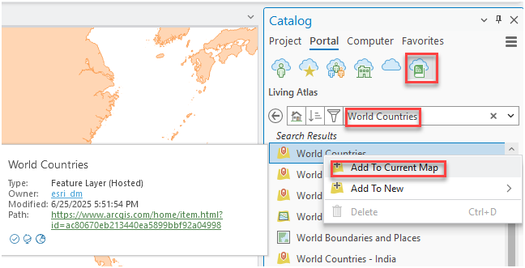
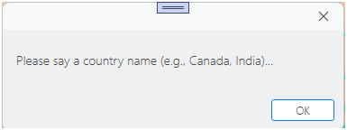
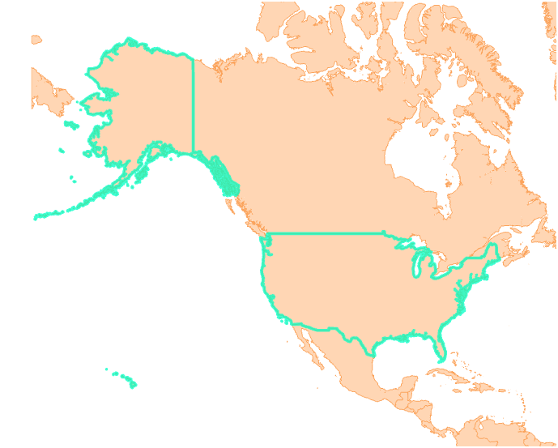

## VoicetoZoomintheMap

<!-- TODO: Write a brief abstract explaining this sample -->
This add-in captures voice inputs and instantly focuses on the specified country, streamlining geographic searches.  

<!-- TODO: Fill this section below with metadata about this sample-->
```
Language:      C#
Subject:       Content
Contributor:   ArcGIS Pro SDK Team <arcgisprosdk@esri.com>
Organization:  Esri, http://www.esri.com
Date:          9/14/2015
ArcGIS Pro:    1.1
Visual Studio: 2013, 2015
```

## Resources

* [API Reference online](http://pro.arcgis.com/en/pro-app/sdk/api-reference)
* <a href="http://pro.arcgis.com/en/pro-app/sdk/" target="_blank">ArcGIS Pro SDK for .NET (pro.arcgis.com)</a>
* [arcgis-pro-sdk-community-samples](http://github.com/Esri/arcgis-pro-sdk-community-samples)
* [FAQ](http://github.com/Esri/arcgis-pro-sdk/wiki/FAQ)
* [ArcGIS Pro SDK icons](https://github.com/Esri/arcgis-pro-sdk/releases/tag/1.1.0.3308)
* [ProConcepts: ArcGIS Pro Add in Samples](https://github.com/Esri/arcgis-pro-sdk-community-samples/wiki/ProConcepts-ArcGIS-Pro-Add-in-Samples)

## How to use the sample
<!-- TODO: Explain how this sample can be used. To use images in this section, create the image file in your sample project's screenshots folder. Use relative url to link to this image using this syntax:  -->
   
1. In Visual Studio, click the Build menu, then select Build Solution.
2. Click the Start button to open ArcGIS Pro.
3. ArcGIS Pro will open.
4. Open any project file. Click on the Catalog pane, select Portal, and then Living Atlas. Next, search for "World Countries" and add it to the map.



5. Click the Voice Zoom Add-in, and it will display a message: "Please say a country name (e.g., Canada, India)...". Click OK and say a country name from this list as those are queries for this sample: "India", "Barbados", "United States", "Canada", "Brazil", "France."

6. We can add queries for as many countries as possible from the attribute table.
7. Now it should zoom to the country boundary on the map according to the recognized voice.
8. For example, if we say "United States," it will zoom to the map boundary of the United States.



<p align = center>
<b> ArcGIS Pro 1.1 SDK for Microsoft .NET Framework</b>
</p>
&nbsp;&nbsp;&nbsp;&nbsp;&nbsp;&nbsp;&nbsp;&nbsp;&nbsp;&nbsp;&nbsp;&nbsp;&nbsp;&nbsp;&nbsp;&nbsp;&nbsp;&nbsp;&nbsp;&nbsp;[Home](https://github.com/Esri/arcgis-pro-sdk/wiki) | <a href="http://pro.arcgis.com/en/pro-app/sdk" target="_blank">ArcGIS Pro SDK</a> | <a href="http://pro.arcgis.com/en/pro-app/sdk/api-reference" target="_blank">API Reference</a> | [Requirements](#requirements) | [Download](#download) |  <a href="http://github.com/esri/arcgis-pro-sdk-community-samples" target="_blank">Samples</a>
