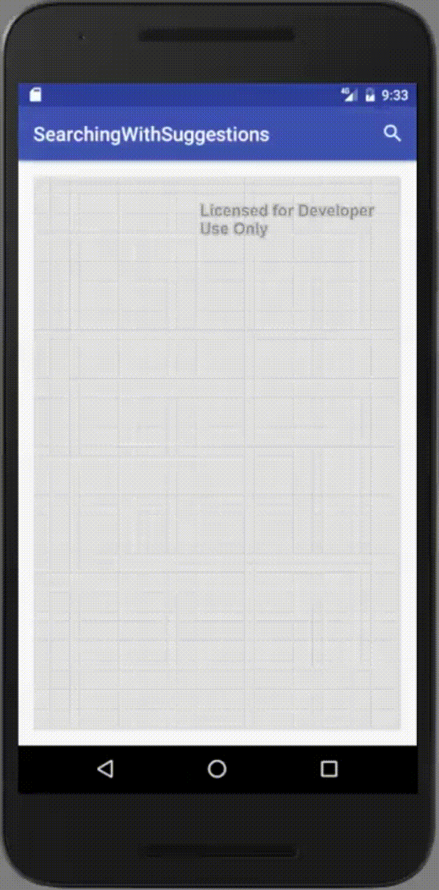

# Geocoding Search Suggestions

## Use case:
You want to use the native android search widget to search for locations in your locator.  You additionally want to ability to see what type of search suggestions the locator returns.

## What is in this sample:
#### MainActivity.java
This is the main activity that the user runs in their application.  This holds a MapView and creates the options menu which houses our search.

```java
  @Override
  public boolean onCreateOptionsMenu(Menu menu) {
  getMenuInflater().inflate(R.menu.search_menu, menu);

  SearchManager searchManager = (SearchManager) getSystemService(SEARCH_SERVICE);
  SearchView searchView = (SearchView) menu.findItem(R.id.app_bar_search).getActionView();
  searchView.setSearchableInfo(searchManager.getSearchableInfo(getComponentName()));
  searchView.setIconified(true);

  return true;
  }
```

Additionally, it performs the operation of getting the index from the data from the search suggestions and the search actions and adds the point to the map.

```java
  private void handleIntent(Intent intent) {
      if(Intent.ACTION_VIEW.equals(intent.getAction())) {
          Log.e("TEST", intent.getData().toString());
          LocatorGeocodeResult lgr = SuggestionHolder.getInstance().FindFeatureFromSearch(Integer.parseInt(String.valueOf(intent.getData())));
          Log.e("NOHE",lgr.getAttributes().toString());
          Point point = new Point(Double.parseDouble(lgr.getAttributes().get("DisplayX")), Double.parseDouble(lgr.getAttributes().get("DisplayY")));
          addAddressToMap(point);
      }
  }
```

#### Data/VirtualContent.java
This provides a static method that allows us to get the suggestions for the Content provider.  This uses a MatrixCursor that is constructed from the ArcGIS Online geocode suggestions results.  The matrix cursor is what populates the content provider which then populates the search suggestions.

#### SuggestionHolder.java
This is a singleton that is populated when the VirtualContent class is run and the search suggestions are populated.  This is used in our MainActivity to quickly pass the suggestion result into the locator rather than spin up a new locator to run the search.

#### AGOLContentProvider.java
This is the content provider that powers the search suggestions.  The important thing to see here is the query method.  The query method is what is called as letters are typed into the search widget.  This goes and grabs the geocode suggestions from ArcGIS Online to power the search suggestions.

```java
@Nullable
@Override
public Cursor query(Uri uri, String[] projection, String selection,
                    String[] selectionArgs, String sortOrder) {
    Log.d(TAG, uri.getLastPathSegment());
    Cursor c = VirtualContent.getSuggestions(uri.getLastPathSegment());
    c.setNotificationUri(getContext().getContentResolver(), uri);
    return c;
}
```

#### SearchMenu.xml
This is what creates the Search Widget to add to the AppCompatActivity bar.

#### AndroidManifest.xml

One line is needed to have the search remain the same acivity that instantiated it.

```xml
<action android:name="android.intent.action.SEARCH" />
```

Additionally, we need to ensure that the app is searchable and we do this by adding a meta-tag:

```xml
<meta-data android:name="android.app.searchable" android:resource="@xml/searchable" />
```

Finally, we need to register the provider inside the Android Manifest.  This is how search suggestions are powered (via content providers).

```xml
<provider
            android:authorities="com.arcgis.androidsupportcases.searchingwithsuggestions.agolcontentprovider"
            android:name=".AGOLContentProvider" />
```

#### Searchable.xml
This is how we specify the properties of the search widget that is declared in the ```mainmenu.xml``` file.  This has a searchSuggestAuthority which is the class that the content provider comes from.  This also has a searchSuggestIntentAction which is what intent will be fired when the search suggestion is clicked on.

##Known Issues:
A few of these classes could be refactored to simplify the searching.  i.e., the singleton SuggestionHolder can be replaced with another class or static method.

## Useful References:

* Android Programming: The Big Nerd Ranch Guide (ISBN-13: 978-0134171456)
* [Creating a Search Interface](https://developer.android.com/guide/topics/search/search-dialog.html)
* [Adding Custom Suggestions](https://developer.android.com/guide/topics/search/adding-custom-suggestions.html)
* [Content Providers](https://developer.android.com/guide/topics/providers/content-providers.html)
* [Creating a Content Provider](https://developer.android.com/guide/topics/providers/content-provider-creating.html)
* [MatrixCursor](https://developer.android.com/reference/android/database/MatrixCursor.html)
* [Esri Android Developers API Reference - Locators](https://developers.arcgis.com/android/api-reference/reference/com/esri/core/tasks/geocode/Locator.html)
* [AsyncTask](https://developer.android.com/reference/android/os/AsyncTask.html)
* [Android: Return search query to current activity](http://stackoverflow.com/questions/5094222/android-return-search-query-to-current-activity)

## Sample in Action

