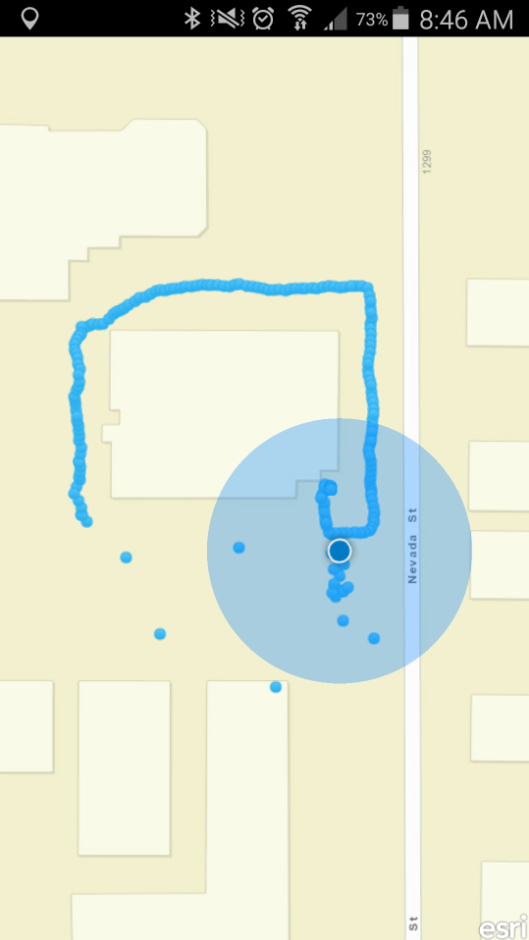

# Show and Track Position
This application aims to show your current location on a map and then tracks that position by adding a point to a feature service.  This is great for hiking or biking where you want to track a trail.  This uses the QtPositioning library and an ArcGIS Online Feature service.



## How did we do it?
1)  First import QtPositioning into your main.qml file.
```qml
import QtPositioning 5.3
```

2)  Add a property to the application window called myLocation and have that be of data type Point.

```qml
property Point myLocation
```

3)  Then in your map object, add the positionDisplay object and set the myLocation variable equal to the position display map point.

```qml
positionDisplay {
    id: pd
    positionSource: PositionSource {
        id: ps
    }
    onMapPointChanged: {
        myLocation = pd.mapPoint;
    }
}
```

4)  We then went to the ArcGIS Developers site and created a feature service where we would like to store our points.  We instantiated a GeodatabaseFeatureServiceTable object and a FeatureLayer Object referencing that table (the table is publically available so there is no need to authenticate users).  Finally, we added a function to the FeatureLayer so we can check to make sure that the FeatureTable has been instantiated.  The definitionAttribute was inserted at the top of the script as a property so we can query our features based off of a field and only display those features.

```qml
property variant definitionAttribute: "test";
```

```qml
GeodatabaseFeatureServiceTable {
            id: featureServiceTable
            url: "http://services.arcgis.com/Wl7Y1m92PbjtJs5n/arcgis/rest/services/NothingInIt/FeatureServer/0"
        }

FeatureLayer {
    id: featureLayer
    featureTable: featureServiceTable
    definitionExpression: "ONE = '"+definitionAttribute+"'"

    function addTracked(feature)
    {
        if (featureTable.featureTableStatus === Enums.FeatureTableStatusInitialized) {
            console.log(featureTable.addFeature(feature));
            featureServiceTable.applyFeatureEdits();
        }
    }
}
```

5)  Next, we created a dummy point object to hold our position as it updates so we can insert the position as we get updates:

```qml
Point {
    id: pointToAdd
    x: 100
    y: 100
    spatialReference: SpatialReference
    {
        wkid:3857
    }
}
```

6)  Now that we have our feature table and our dummy point, we can set the custom behavior for when our point updates.  WE will be creating a feature and inserting that feature with its attributes into the GeodatabaseFeatureServiceTable through the addTracked method of the FeatureLayer object.  We also want the display to pan with us as we move, so we have enabled the positionDisplay mode to that of AutoPanModeCompass.  Here is the updated positionDisplay:

```qml
positionDisplay {
    id: pd
    zoomScale: 17
    mode: Enums.AutoPanModeCompass;
    positionSource: PositionSource {
        id: ps
    }
    onMapPointChanged: {
        if (pd.geoPoint.x != 0 && pd.geoPoint.y != 0)
        {
            pointToAdd.setXY(pd.mapPoint.x, pd.mapPoint.y);
            var featureToAdd = ArcGISRuntime.createObject("Feature");
            featureToAdd.geometry = pointToAdd;
            featureToAdd.setAttributeValue("One", "test");
            console.log(featureToAdd.toString())
            featureLayer.addTracked(featureToAdd);
        }
    }
}
```

## Resources

* [PositionDisplay Class Reference](https://developers.arcgis.com/qt/qml/api-reference/class_position_display.html)

* [Edit features guide](https://developers.arcgis.com/qt/qml/guide/edit-features.htm)

* [Hosted Data Editor](https://developers.arcgis.com/en/hosted-data/)

* [Position DisplayGuide](https://developers.arcgis.com/qt/qml/guide/position-display.htm)
