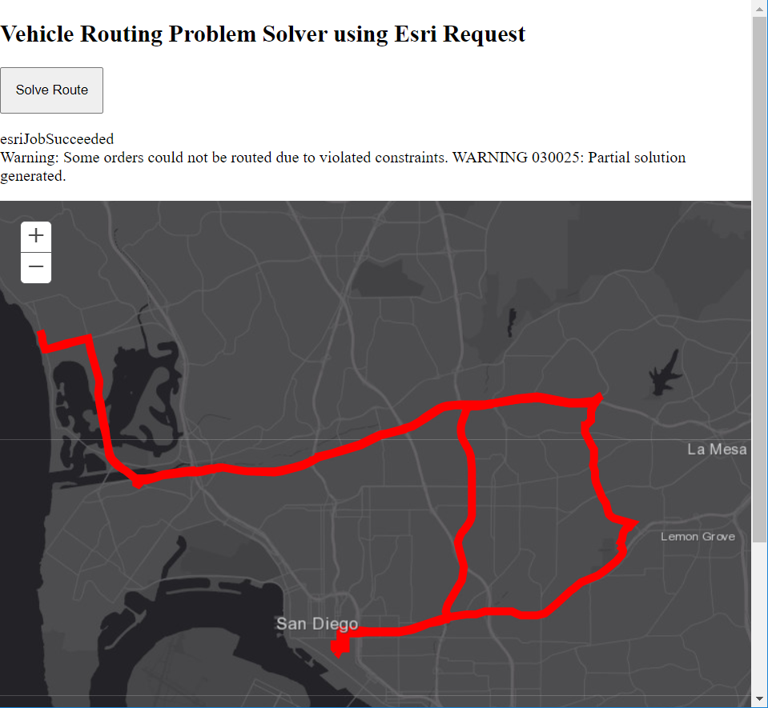

# Vehicle Routing Problem Solver

This project uses the ArcGIS JavaScript API 3.x to return routes for a Vehicle Routing Problem Service using esriRequests. This sample uses the [SampleServer6 Network Analysis Service](https://sampleserver6.arcgisonline.com/arcgis/rest/services/NetworkAnalysis/SanDiego/GPServer/SolveVehicleRoutingProblem)



## Getting Started

This html file is ready for deployment.

## How to use the sample

Run the application.
Click on the "Solve VRP" button to initiate the Vehicle Routing Problem Service with its hard-coded parameters in the index.html file. The following code demonstrates the use of the esriRequest to submit the parameters with a POST request to the service:
```javascript
 var params = {
    "f":"json",
    "orders": orders,
    "depots": depots,
    "routes": routes,
    "time_units": time_units,
    "distance_units": distance_units,
    "default_date": date
 }

var requestHandle = esriRequest({
    url: vrpServiceUrl + "/submitJob?",
    content:params
},{usePost:true});
```

There are follow up requests to continue checking the job status until it succeeds. Once it succeeds, the route data returned is fetched with another esriRequest, and Polylines are created from the routes. The Polylines are then added as Graphics onto the Map.

```javascript
var requestHandle = esriRequest({
    url: jobCheckId,
    content:{
        "f":"json",
        "returnMessages": true
    },
},{usePost:true});

requestHandle.then((response)=>{
    resultNode.innerHTML = response.jobStatus;
    switch(response.jobStatus){
        case 'esriJobSubmitted':
            checkJobStatus(jobId); //keep checking the job status
            break;
        case 'esriJobExecuting':
            checkJobStatus(jobId); //keep checking the job status
            break;
        case 'esriJobSucceeded':
            populateResults(response);
            returnRoutes(jobId);
            break;
        default:
            console.log("did not complete or failed...");
            break;
    }
}).catch((err)=>{
    console.log("failed job status with: " + err);
});
```

## Deployment
One can deploy the application over a local web server (example: ISS), but it can also be ran directly from your computer by double clicking the html file when downloaded.

## Built With

* [ArcGIS JavaScript API](https://developers.arcgis.com/javascript/3/) - Using the 3.32 JavaScript API

## Relevant API
* Map
* esriRequest
* Polyline
* Graphic
* GraphicsLayer

## [Live Sample](https://esri.github.io/developer-support/web-js/3.x/vehicle-routing-problem-solver/)
