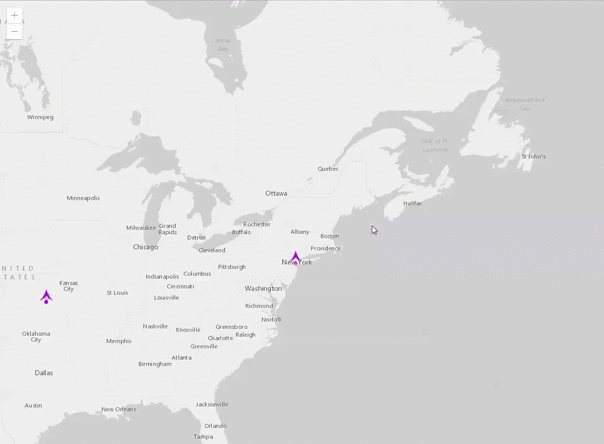

#Add Attachments To FeatureService with JavaScript 4.2

##About
FeatureServices can be configured to allow files to be attached to individual features in the service. In the 3.x JavaScript API methods to retrieve, add and delete attachments were provided as part of the FeatureLayer class. Additionally widgets such as the attachment and attribute inspector allowed attachments to be viewed and edited. In the 4.2 API no widgets or methods have been provided to work with attachments. However it is still possible to directly query and edit attachments using the ArcGIS REST API. This sample shows how to work with attachments within a 4.2 application.



[Live Sample](https://esri.github.io/add-attachments-with-42/index.html)

##Usage Notes
This sample allows the user to click on a feature in the map to view a popup. At the bottom of the popup is a button called "Add Attachments". Clicking this button allows attachments to be added using a file picker dialog. Attachments currently attached to the feature will be shown in the popup. These attachments can be downloaded or deleted by clicking the buttons beside them.

##How It Works
When a new feature is shown in the popup a request is sent to get any attachments associated with that feature. This is a GET request made with jQuery.
```javascript
var url = feature.layer.url + "/" + feature.layer.layerId + "/" + feature.attributes.objectid;
$.get(url + "/attachments?f=json", function(data, status) {
	addAttachmentsToPopup(data, status, url);
});
```

Using a for loop the attachments returned by the above GET request are iterated and added to an HTML string. This string is then appended to the end of the popup's HTML. As the number of attachments is unknown this cannot be configured with a popup template and must be added programatically each time a new feature is loaded.
```javascript
var html = "<div class='attachment-header'>Attachments:";
for(var i = 0; i < json.attachmentInfos.length; i++) {
	html += "<div class='attachment-item'><div class='attachment-name'>" + json.attachmentInfos[i].name + "</div><div class='download-attachment' value='" + url + "/attachments/" + json.attachmentInfos[i].id + "'></div><div class='delete-attachment' value='" + url + "/deleteAttachments?f=json&attachmentIds=" + json.attachmentInfos[i].id + "'></div></div>";
}
html += "</div>";
view.popup.content.innerHTML += html;
```

A bit of a trick is required to actually download the attachment. First a hyperlink element is created. The reference of this hyperlink is the url of the attachment on the ArcGIS Server. The hyperlink is then appended to the body of the document. The hyperlink is unseen by the user. The "click" event of the hyperlink is then triggered causing the file to be downloaded. The link is then removed from the body and deleted.
```javascript
var link = document.createElement("a");
link.download = name;
link.href = url;
document.body.appendChild(link);
link.click();
document.body.removeChild(link);
delete link;
```

To delete an attachment a GET request is sent the deleteAttachments operation of the FeatureService. The html representation of the attachment is then deleted from the popup.
```javascript
$.get(url, function(data, status) {
	var json = JSON.parse(data);
	$(element).parent().remove();
});
```

To allow uses to use a file picker to select the files they wish to upload I use a form with an input of type file. An initial parameter of "f=json" is added to the form as this parameter will be needed each time an attachment is added to the service. The "change" event listener is added to the file picker to notify the application that a file has been selected.
```html
<form id="data" enctype="multipart/form-data" method="post" >
	<input id="fileSelector" type="file" name="attachment">
	<input name="f" value="json">
</form>
```
```javascript
$("#fileSelector").change(uploadFile);
```

A normal AJAX POST request is insufficient to upload a file. To do this we must use an XMLHttpRequest. First create a FormData object from the form created above. Then open a POST to the addAttachment endpoint of the FeatureService. Then set an onload event handler for the request object to update the popup window. Finally send the form data.
```javascript
var form = $("#data")[0];
var formData = new FormData(form);
		
var request = new XMLHttpRequest();
request.open("POST", view.popup.selectedFeature.layer.url + "/" + view.popup.selectedFeature.layer.layerId + "/" + view.popup.selectedFeature.attributes.objectid + "/addAttachment");

request.onload = function(e) {
	var json = JSON.parse(request.responseText);
	if(json.addAttachmentResult.success == true) {
		updatePopup();
	}
	else {
		alert("Could not upload the file!");
	}
}

request.onerror = function(e) {
	alert("Could not upload the file!");
}
			
request.send(formData);
```
