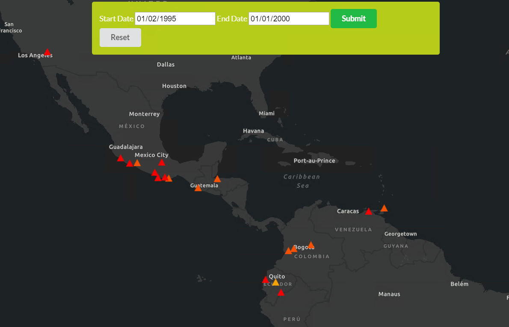

# Filter with a date range, client-side FeatureLayer

This project uses the ArcGIS JavaScript API 4.x to filter the client-side graphics on the screen using the FeatureLayerView, and the filter property. 



## Getting Started

This html file is ready for deployment. This sample uses the [Earthquaktes1970](Earthquakes1970) feature service from [sampleserver6.arcgisonline.com](https://sampleserver6.arcgisonline.com/arcgis/rest/services).

## How to use the sample

Run the application.
Once the data has loaded, you can use the two date inputs to choose the start and end date for the date range you would like to filter by.
Click submit to filter the FeatureLayerView, which executes the following code:
```javascript
featureLayerView.filter = {
    where: `${dateField} > DATE '${startDate}' AND ${dateField} < DATE '${endDate}'`
}
```

## Deployment
One can deploy the application over a local web server (example: ISS), but it can also be ran directly from your computer by double clicking the html file when downloaded.

## Built With

* [ArcGIS JavaScript API](https://developers.arcgis.com/javascript/) - Using the 4.15 JavaScript API
* [Semantic UI](https://semantic-ui.com) for the css of the ui components

## Relevant API
* Map
* MapView
* FeatureLayerView
