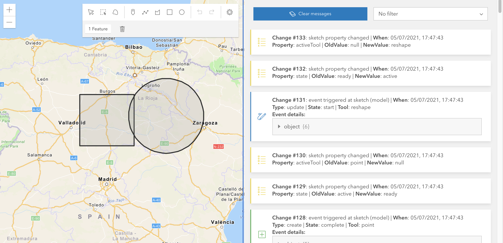

# Sketch widget event explorer

This is a [sample app](https://esri.github.io/developer-support/web-js/4.x/sketch-widget-event-explorer/README.md) to get familiar with the Sketch widget events lifecycle and the state changes:

The code observes for most changes and will display some info on the right.
