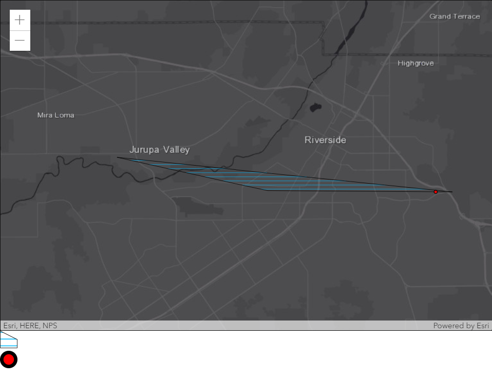

# Display graphic symbols as div elements

This project uses the ArcGIS JavaScript API 4.x to create DOM elements from the MapView's graphics' symbols.



## Getting Started

This html file is ready for deployment.

## How to use the sample

Run the application.
Once the data has loaded, you can see that the SimpleFillSymbol for the Polygon Graphic and the SimpleMarkerSymbol for the Point Graphic appear as div elements underneath the MapView. The code below is needed for this to be possible:
```javascript
symbolUtils.renderPreviewHTML(sms, {
    node: document.getElementById("smsNode"),
    size: 20
})
```

## Deployment
One can deploy the application over a local web server (example: ISS), but it can also be ran directly from your computer by double clicking the html file when downloaded.

## Built With

* [ArcGIS JavaScript API](https://developers.arcgis.com/javascript/) - Using the 4.15 JavaScript API

## Relevant API
* Map
* MapView
* symbolUtils
