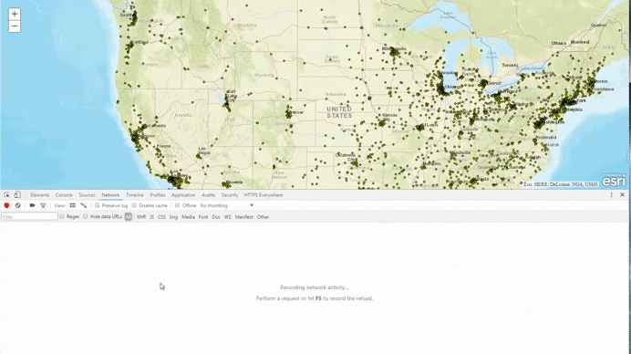

# Add Timestamp to WMS Requests

## About
Browsers often cache images to boost performance by limiting the number of requests that web applications need to send. While this feature is often helpful, it can be a hinderance in situations where data is constantly being updated. Consider this example. Let's say you are working with a WMS service showing realtime locations of ships. Thus while the extent of the map may not change (triggering no new requests) the data has changed meaning the image needs to be updated. Setting a refresh interval on the WMSLayer is of course the best way to handle this problem. However you will probably find your browser caches the image and does not re-issue the request because the request parameters have not changed. One potential workaround for this issue is to use timestamps.



## Usage Notes
If you wrote the code to get the image you could including a Cache-Control header in the request that would prevent this problem. Because the API is sending the requests you will need to re-implement the getImageUrl method of the WMSLayer class. Please note the JavaScript API requires the use of the Esri Resource proxy when consuming WMS services. You can read more about how to setup and [configure the proxy here](https://developers.arcgis.com/javascript/3/jshelp/ags_proxy.html). Due to this requirement a live version of the application cannot be hosted in Github.

## How It Works
After the WMSLayer loads make a copy of the getImageUrl method. Then re-implement the WMSLayer's getImageUrl method. To ensure the function behaves the same way call the copy of the original function made in step one. The only difference is a time stamp parameter is added to the request URL in the callback function.
```javascript
map.on("layer-add-result", function(evt) {
	var getImageUrl = wmsLayer.getImageUrl;
		if(evt.layer.title == "Specialty/ESRI_StatesCitiesRivers_USA") {
			wmsLayer.getImageUrl = function (extent, width, height, callback) {
				var result = getImageUrl.call(wmsLayer, extent, width, height, function(url) {
					callback.call(wmsLayer, url + "&_timeStamp=" + new Date().getTime() );
				})
			return result;
		};
	}
});
```

The timeStamp parameter added to the request will look similar to this:

&_timeStamp=1484064028192
