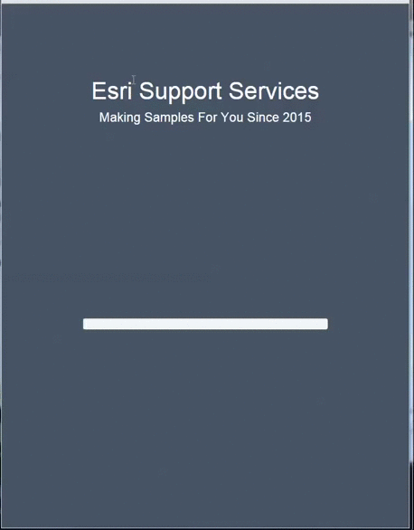

#Map With Loading and Splash Screens

##About
I have been asked by at least a dozen customers to help them implement a loading or splash screen in their mapping application. This sample shows how to implement a simple loading screen and a splash screen using Bootstrap, jQuery and Javascript.



##Usage Notes
The progress bar on the loading screen is not hooked up to any events in the application. It simply takes two seconds to fill the progress bar and this gives the layers in the map enough time to load. If you wanted to listen for events in the application you could use a spinner instead of a progress bar and wait until all layers have fully loaded.

##How It Works
Create your loading and splash screens in the HTML. Apply an event handler to your splash screen button to remove the screen.
```javascript
$(".btn-primary").click(function() {
	$("#splashScreen").fadeOut('slow');
});
```

To animate the progress bar smoothly I used a recursive function to increment the width of the progress bar by 1% every twenty seconds. While this could be done using the setInterval() method this method has a well known memory leak and it is best to not get in the habbit of using it. When the check condition fails the code waits one second before hiding the loading screen and fading in the splash screen.
```javascript
function incrementSlider() {
	if(increment <= 100) {
		setTimeout(function() {
			progressbar.css("width", "" + increment + "%");
			increment += 1;
			incrementSlider();
		}, 20);
	}
	else {
		setTimeout(function() {
			$("#container").hide();
			$("#splashScreen").fadeIn('slow');
		}, 1000);
	}
}
```
