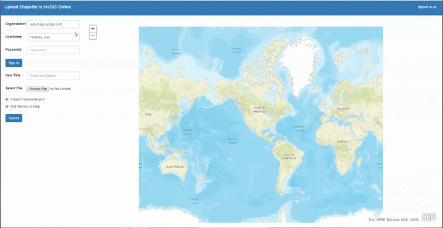

#Upload Zipped Shapefile to ArcGIS Online

##About
ArcGIS Online allows users to upload shapefiles and store them in their content. It is also possible to create a FeatureService hosted in ArcGIS Online from the shapefile. This sample was written at the request of a customer and shows how to upload a zipped shapefile to ArcGIS Online using JavaScript and the REST API. Additionally this application allows users to programmatically publish the shapefile as a FeatureService and then view the FeatureService within the application as a FeatureLayer.



[Live Sample](https://nhaney90.github.io/upload-shapefile-to-agol/index.html)

##Usage Notes
Before a shapefile can be uploaded you must sign into ArcGIS Online (this application should work with a Portal instance as well). Enter your organization's domain (without including "http" or "https") and your username and password then click the "Sign In" button. You should now be shown as signed in at the top right. Now enter the title of the shapefile and then select a zipped shapefile with the file picker. The check boxes allow you to create a FeatureService from the shapefile and add the service to the map. Next press the "Submit" button. If you select the "Add Service to Map" option this step may take some time depending on the size of the shapefile. Finally the FeatureLayer should appear in the map. Please view the above gif.

##How It Works
A token must be used to access the ArcGIS Online account. This can be done by using EsriRequest to send a request to the generateToken endpoint of ArcGIS Online.
```javascript
var layersRequest = esri.request({
    url: "https://" + $("#org").val() + "/sharing/rest/generateToken",
    content: {
        username: $("#username").val(),
        password: $("#password").val(),
        client: "referer",
		referer: window.location.href,
        expiration: 5,
        f: "json"
    },
    handleAs: "json",
}, { "usePost": true });
```

A form with an input of type file allows users to select the shapefile they wish to upload. Remember the shapefile must be in a zipped folder and include all necessary files.
```html
<form id="data" enctype="multipart/form-data" method="post" role = "form">
	<div class = "form-group" style="margin-bottom: 27px !important">
		<label for = "file">Select File</label>
		<input type = "file" id = "file" name = "file" class="btn input-elements" style="margin-right: 15px">
	</div><br/>
</form>
```

A normal AJAX POST request is insufficient to upload a file. To do this we must use an XMLHttpRequest. First create a FormData object from the form created above. Additional required parameters are then appended to the FormData object. Next open a POST to the addItem endpoint of ArcGIS Online. Then set an onload event handler for the request object to create the FeatureService if needed. Finally send the form data.
```javascript
var form = $("#data")[0];
var formData = new FormData(form);
formData.append("type", "Shapefile");
formData.append("title", $("#title").val());
formData.append("itemType", "file");
formData.append("purpose", "Ready To Use");
formData.append("typeKeywords","Data, Layer");
formData.append("async", "false");
formData.append("f","json");
formData.append("token",token);

var request = new XMLHttpRequest();
request.open("POST", "https://" + $("#org").val() + "/sharing/rest/content/users/" + $("#username").val() + "/addItem");
request.onload = function(e) {
	var json = JSON.parse(request.responseText);
	if(json.success == true) {
		if($('#featureServiceCB').prop('checked') == true) {
			createFeatureService(json.id);
		}
	}
}
			
request.send(formData);
```

To create the FeatureService a request must be sent to the "publish" endpoint of the hosted shapefile item. This request can be made using the EsriRequest class.
```javascript
var createServiceRequest = esri.request({
	url: "https://" + $("#org").val() + "/sharing/rest/content/users/" + $("#username").val() + "/publish",
    content: {
        token: token,
		itemId: id,
		filetype: "shapefile",
		publishParameters: '{"hasStaticData":true, "name":"' + $("#title").val() + '","maxRecordCount":2000,"layerInfo":{"capabilities":"Query"}}',
        f: "json"
    },
    handleAs: "json",
    headers: {
        "X-Requested-With": null
    }
}, { "usePost": true });
```

After the FeatureService has been published it is not immediately ready to receive requests. To test if the service is ready requests are sent (once again using EsriRequest) to the service's endpoint. If the service is not ready these requests will fail. After a request fails the code waits 1.5 seconds before sending the request again. When the request succeeds this indicates the service is ready and the FeatureLayer can now be created.
```javascript
var checkStatusRequest = esri.request({
    url: url,
    content: {
		token: token,
        f: "json"
    },
    handleAs: "json"
}, { "usePost": false });

checkStatusRequest.then(
	function (response) {
		addFeatureLayer(url + "?token=" + token);
		$("#pendingText").css("visibility", "hidden");
	},
	function (error) {
		setTimeout(function() {
			checkServiceStatus(url);
		}, 1500);
	}
);
```
